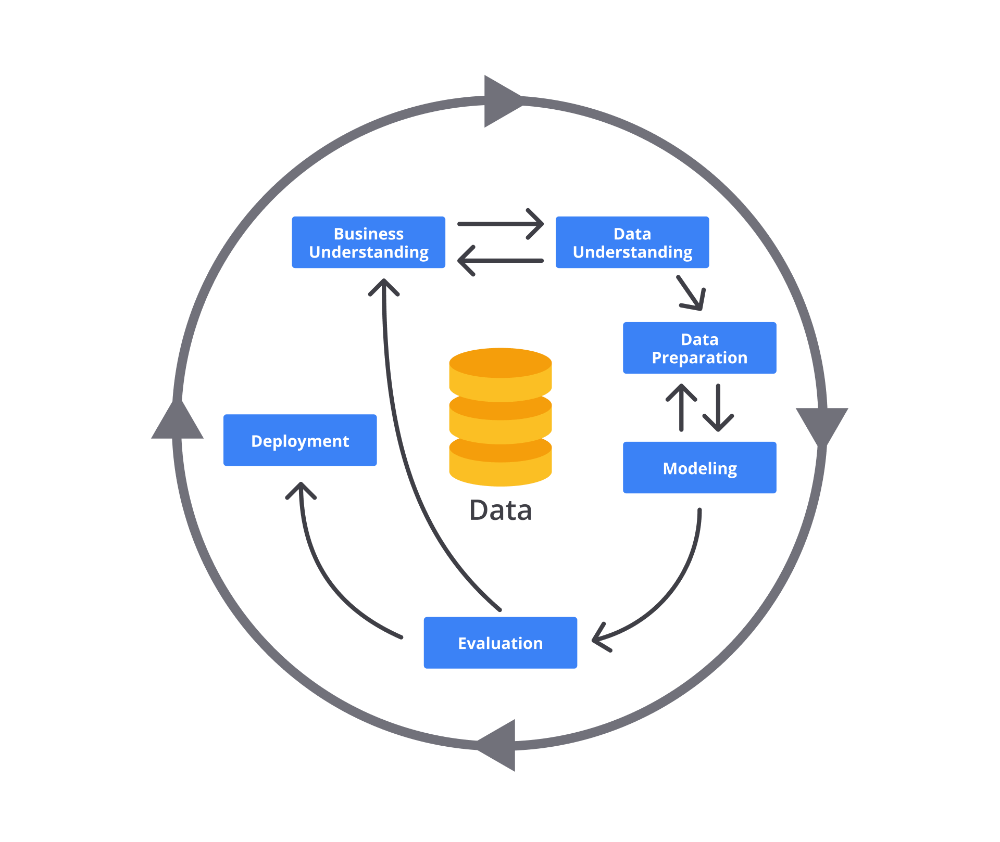
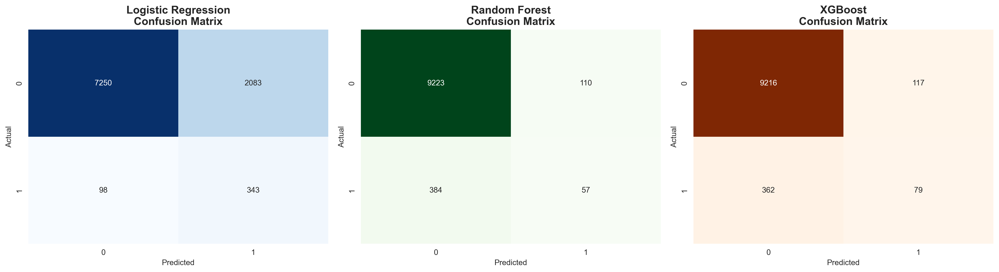
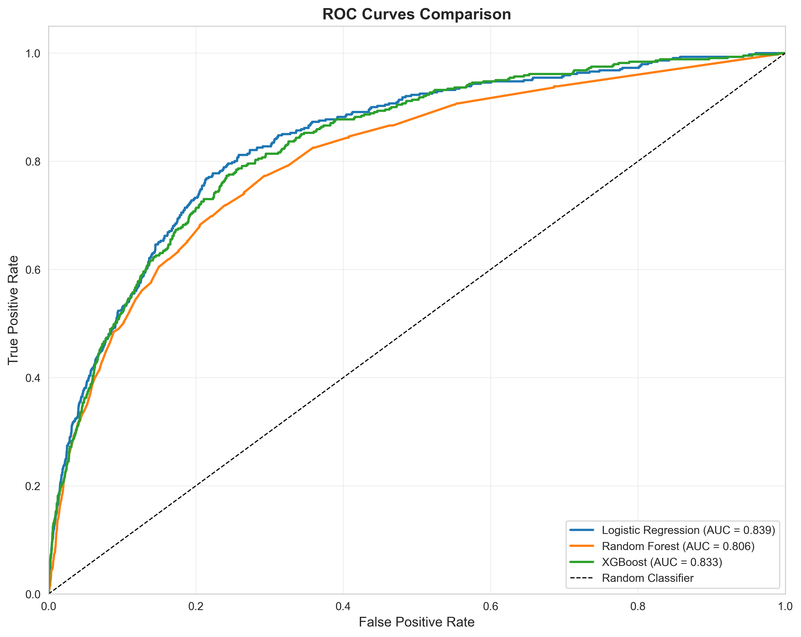
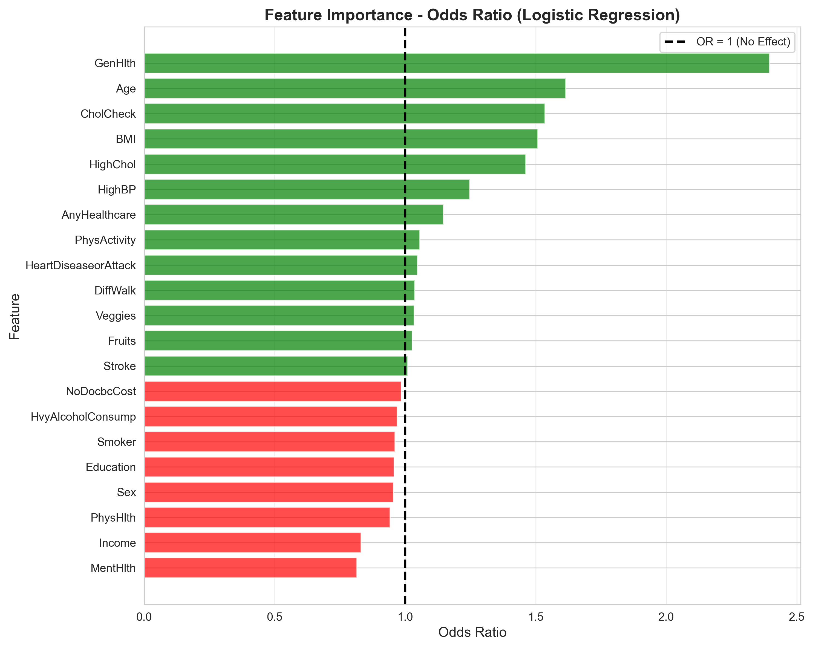
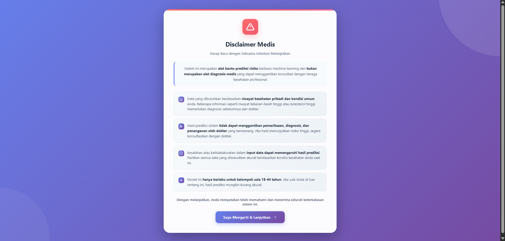
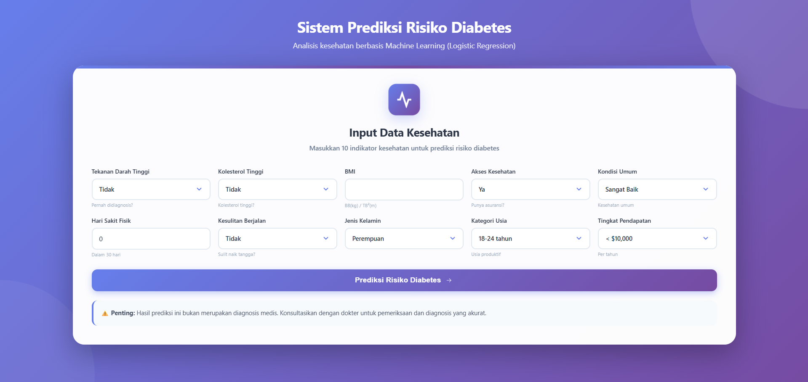
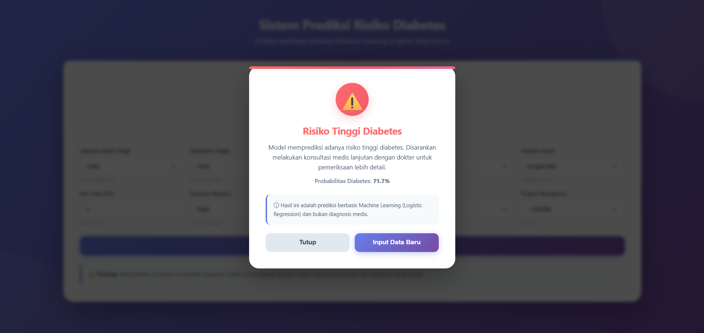
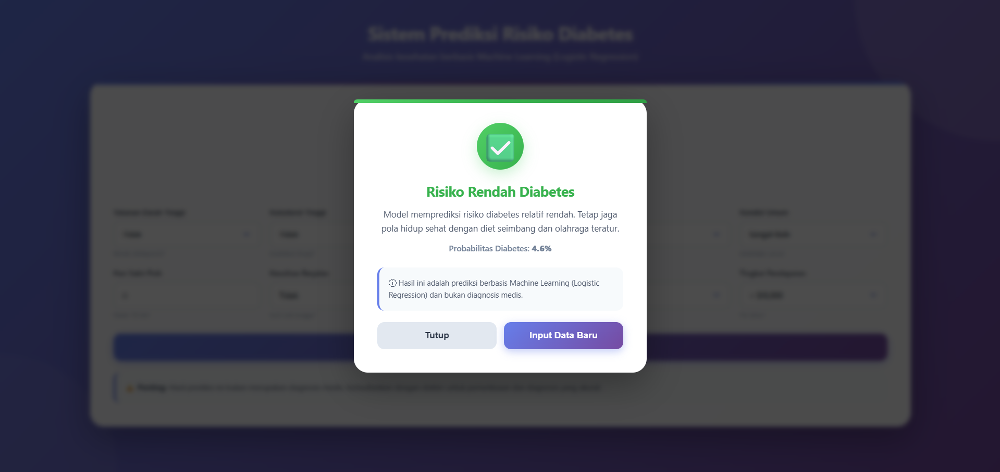

# Diabetes Risk Classification System
> Early detection of diabetes risk in productive age groups (18–44 years) 
> using Machine Learning — Undergraduate Thesis Project


---

## Overview
Diabetes mellitus merupakan salah satu penyakit kronis dengan prevalensi 
tinggi pada kelompok usia produktif. Penelitian ini mengembangkan model 
klasifikasi dini risiko diabetes menggunakan pendekatan machine learning 
dengan metodologi CRISP-DM, diimplementasikan dalam prototipe aplikasi 
web berbasis Flask.

---

## Dataset
- **Sumber:** CDC Behavioral Risk Factor Surveillance System (BRFSS) 2015
- **Platform:** Kaggle — Diabetes Health Indicators Dataset
- **Total observasi:** 48.867 (setelah filter usia 18–44 tahun & hapus duplikat)
- **Class distribution:** 95.49% non-diabetes, 4.51% diabetes
- **Class imbalance handling:** SMOTE (rasio 21.15:1 → 1:1)

---

## Metodologi (CRISP-DM)


| Tahap | Keterangan |
|---|---|
| Business Understanding | Identifikasi kebutuhan skrining dini diabetes usia produktif |
| Data Understanding | Eksplorasi CDC BRFSS 2015, 22 fitur awal |
| Data Preparation | Filter usia, drop duplikat, SMOTE, StandardScaler |
| Modelling | Logistic Regression, Random Forest, XGBoost |
| Evaluation | Accuracy, Precision, Recall, F1-Score, ROC-AUC |
| Deployment | Prototipe web app berbasis Flask |

---

## Selected Features (Mutual Information)
10 fitur optimal dipilih menggunakan Mutual Information + Elbow Curve Analysis:

| Fitur | Keterangan |
|---|---|
| HighBP | Tekanan darah tinggi |
| HighChol | Kolesterol tinggi |
| BMI | Indeks massa tubuh |
| AnyHealthcare | Akses layanan kesehatan |
| GenHlth | Status kesehatan umum |
| PhysHlth | Jumlah hari kondisi fisik buruk |
| DiffWalk | Kesulitan berjalan |
| Sex | Jenis kelamin |
| Age | Kategori usia |
| Income | Tingkat pendapatan |

---

## Model Performance

| Model | Accuracy | Precision | Recall | F1-Score | ROC-AUC |
|---|---|---|---|---|---|
| **Logistic Regression** | 0.7769 | 0.1414 | **0.7778** | 0.2393 | **0.8385** |
| Random Forest | 0.9445 | 0.3413 | 0.1293 | 0.1875 | 0.8059 |
| XGBoost | 0.9510 | 0.4031 | 0.1791 | 0.2480 | 0.8327 |

> **Logistic Regression dipilih** karena recall tertinggi (77.78%) — 
> dalam konteks skrining kesehatan, mendeteksi sebanyak mungkin 
> individu berisiko lebih diprioritaskan daripada akurasi keseluruhan.

### Confusion Matrix


### ROC Curve


---

## Feature Importance (Odds Ratio)


| Fitur | Odds Ratio | Interpretasi |
|---|---|---|
| GenHlth | 2.28 | Kesehatan buruk → risiko naik 128% |
| Age | 1.58 | Tiap kenaikan kategori usia → risiko naik 58% |
| BMI | 1.49 | Obesitas → kontribusi resistensi insulin |
| HighChol | 1.45 | Kolesterol tinggi → sindrom metabolik |
| HighBP | 1.26 | Tekanan darah tinggi → sindrom metabolik |
| Income | 0.84 | Pendapatan lebih tinggi → risiko turun 16% |

---

## Tampilan Aplikasi

### Halaman Disclaimer


### Form Input Data Kesehatan


### Hasil Prediksi Risiko Tinggi


### Hasil Prediksi Risiko Rendah


---

## Cross-Validation Results (5-Fold Stratified)

| Metric | Mean | Std |
|---|---|---|
| Accuracy | 0.7768 | ±0.0029 |
| Recall | 0.7502 | ±0.0235 |
| ROC-AUC | 0.8377 | ±0.0107 |

---

## Run Locally
```bash
# Clone repo
git clone https://github.com/gzxos/diabetes-prediction-ml.git
cd diabetes-prediction-ml

# Install dependencies
pip install -r requirements.txt

# Run app
python app.py
```

Buka browser → `http://localhost:5000`

---

## Deployment Note
Aplikasi ini tidak dipublikasikan secara publik karena domain kesehatan 
memerlukan validasi klinis dari tenaga medis sebelum deployment. 
Model ini dirancang sebagai alat skrining awal, **bukan pengganti 
diagnosis medis**.

---

## Research Paper
https://journals2.ums.ac.id/saintek/article/view/16430

---

## Tech Stack
- Python 3.11
- Flask 3.0.0
- scikit-learn 1.3.2
- XGBoost 2.0.3
- Joblib 1.3.2
- Pandas 2.1.3
- NumPy 1.26.4